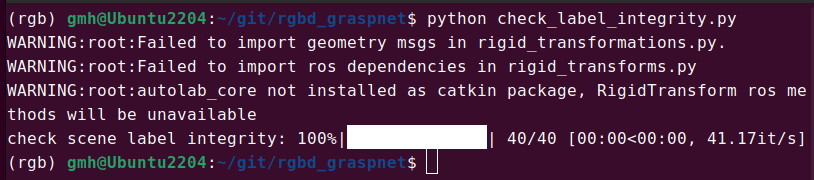
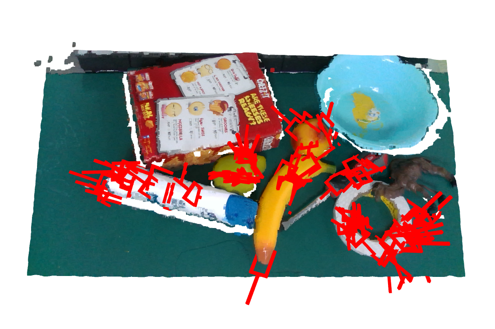
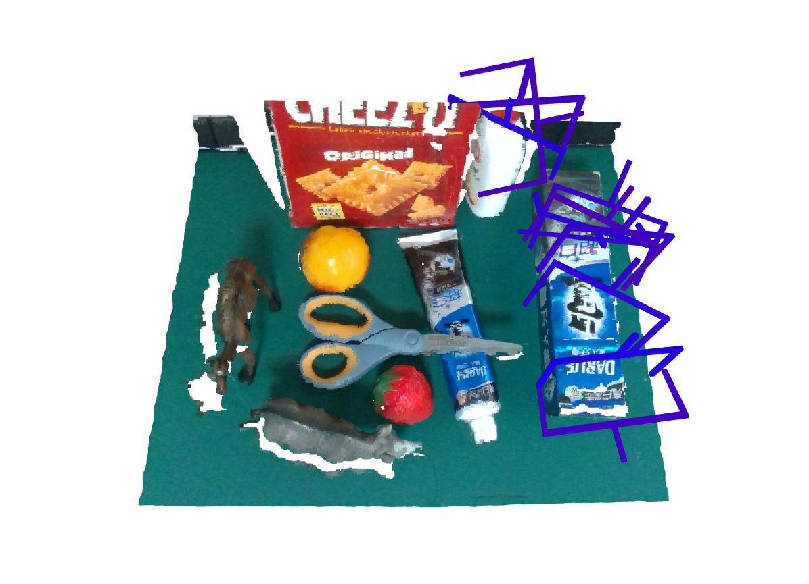
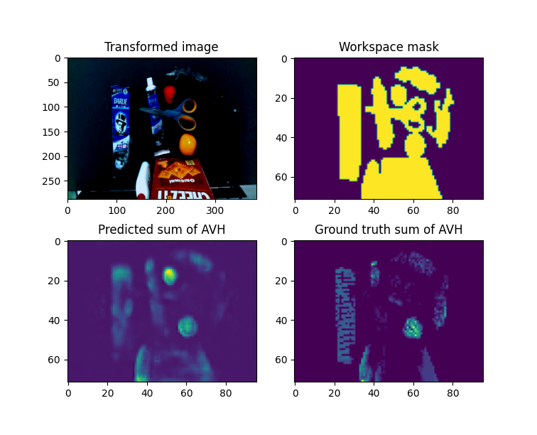

# rgbd_graspnet
[](https://graspnet.net/index.html)
Implementation for ICRA 2021 paper [RGB Matters: Learning 7-DoF Grasp Poses on Monocular RGBD Images](https://arxiv.org/pdf/2103.02184).

Project Website [https://graspnet.net/publications.html](https://graspnet.net/publications.html)

## Installation
```bash
git clone https://github.com/GouMinghao/rgb_matters
cd rgb_matters

# virtualenv, conda or docker are strongly suggested.
python3 -m pip install -r requirements.txt
```

## Download the GraspNet dataset
Download and setup following the [official website](https://graspnet.net/datasets.html).

## Generate label
1. Modify the values in [constant.py](rgbd_graspnet/constant.py) to your own.
2. Run `gen_labels.py`
```bash
# Around 260G space is needed if all the labels are generated.
python3 gen_labels.py
```
3. Check if all labels are generated.
```bash
python3 check_label_integrity.py
```
No errors will be presented if all labels exist.



4. Visualize the generated labels.
```bash
python3 vis_label.py
```


## Generate normals (optional)
If you want to use the normal modality, you should generate normals by running the following scripts.
```bash
# Around 130G space is needed if all the normals are generated.
python3 gen_normals.py
```

## Training

### Training on a sinlge GPU
```bash
cd rgb_matters

# bash train.sh [config name] [GPU Ids] [ddp port](default=12345)
bash train.sh 0 rs_rs_no_norm 12345 # training with rs_rs_no_norm.yaml config with GPU 0.
```

### Training on multiple GPUs
```bash
cd rgb_matters

# bash train.sh [config name] [GPU Ids] [ddp port](default=12345)
bash train.sh 1,2 rs_rs_no_norm  # training with rs_rs_no_norm.yaml config with GPU 1 and 2.
```

### FAQ
**Q1:** Can I train on CPU.

**A1:** We don't support training on CPU, you can modify the code to train on it. However, it is not suggested.


**Q2:** CUDA out of memory error.

**A2:** Try to reduce the batch size in config file.

## Pretrained model
1. Download from [Google Drive](https://drive.google.com/drive/folders/1upW4gvQk5ftXfpLHtvCogudpP4kNyoGq?usp=sharing).

2. Create a directory named `weights` and put the downloaded files into it as below.
```
rgbd_graspnet/
├── check_label_integrity.py
├── train.py
├── train.sh
├── vis_label.py

...

└── weights
    ├── kn_jitter_79200.pth
    ├── kn_no_norm_76800.pth
    ├── kn_norm_63200.pth
    ├── kn_norm_only_73600.pth
    └── rs_norm_56400.pth
```


## Run a demo
Change `resume` in [demo.sh](demo.sh) and run it.
```bash
bash demo.sh
```



## License
This repo is under [MIT license](LICENSE).

## Citation
If you find this repo useful in your research, you should cite the following two papers
```bibtex
@inproceedings{gou2021RGB,
  title={RGB Matters: Learning 7-DoF Grasp Poses on Monocular RGBD Images},
  author={Minghao Gou, Hao-Shu Fang, Zhanda Zhu, Sheng Xu, Chenxi Wang, Cewu Lu},
  booktitle={Proceedings of the International Conference on Robotics and Automation (ICRA)},
  year={2021}
}

@inproceedings{fang2020graspnet,
  title={GraspNet-1Billion: A Large-Scale Benchmark for General Object Grasping},
  author={Fang, Hao-Shu and Wang, Chenxi and Gou, Minghao and Lu, Cewu},
  booktitle={Proceedings of the IEEE/CVF Conference on Computer Vision and Pattern Recognition (CVPR)},
  pages={11444--11453},
  year={2020}
}
```
